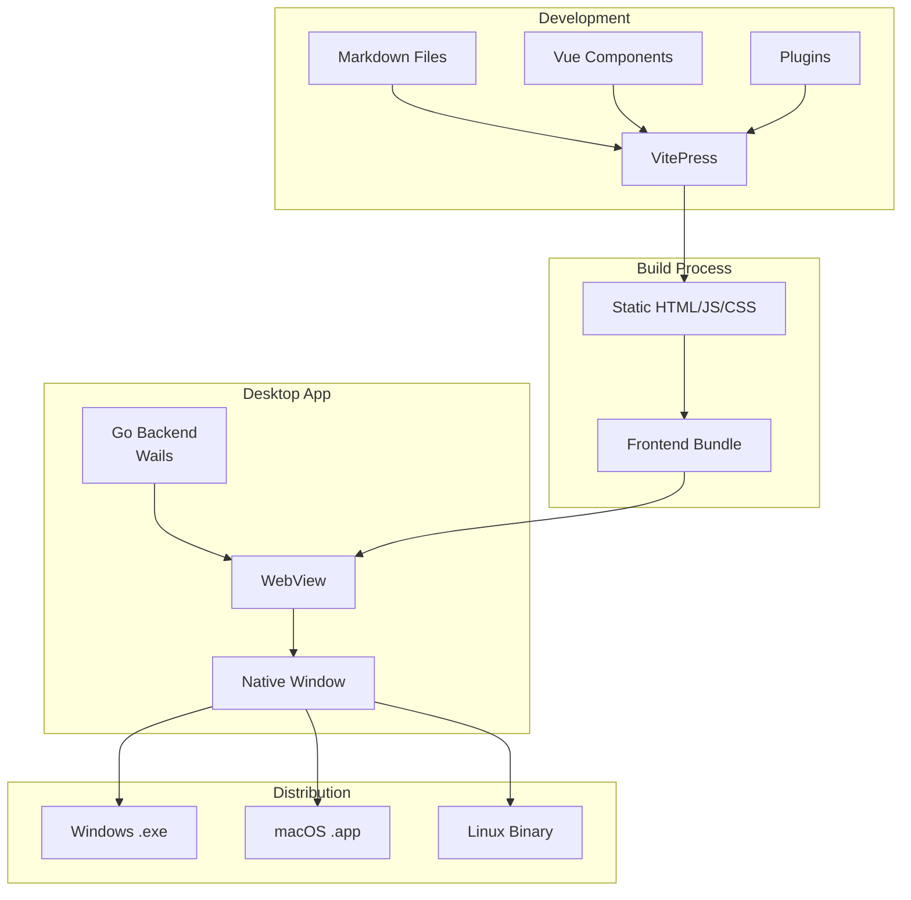
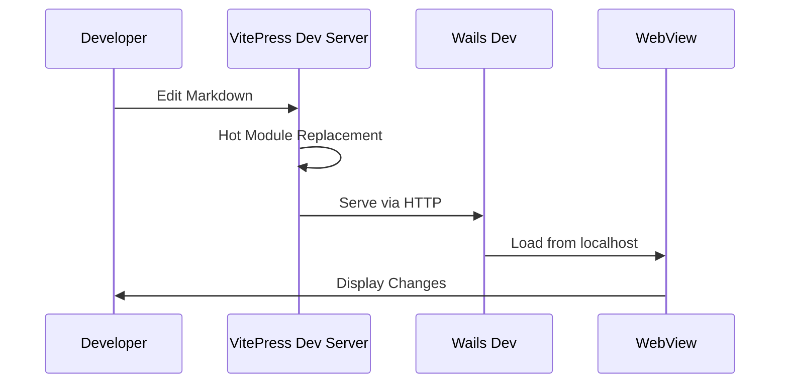
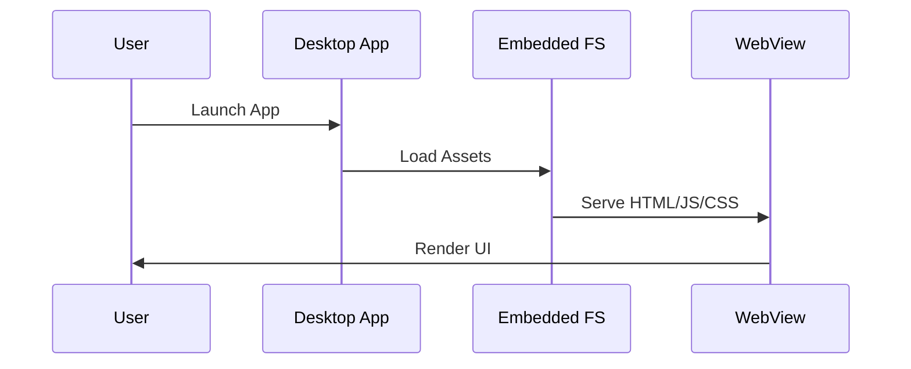
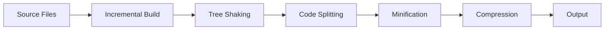
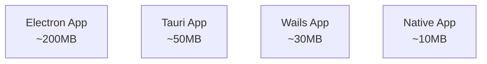
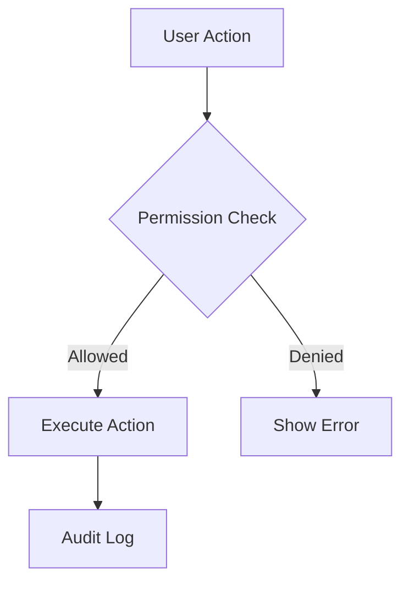
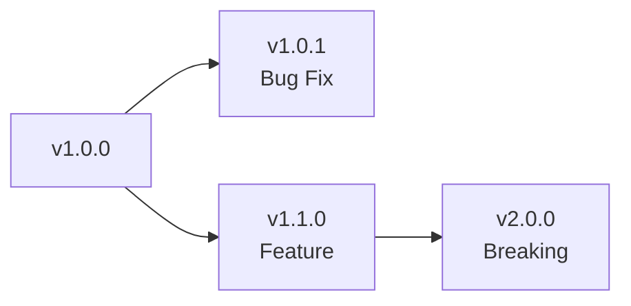

# 아키텍처 개요

VitePress Desktop의 내부 구조와 작동 방식을 상세히 설명합니다.

## 🏗️ 전체 아키텍처



## 📊 컴포넌트 구조

### 1. Frontend Layer (VitePress)

```
docs/
├── .vitepress/
│   ├── config.js          # VitePress 설정
│   ├── theme/             # 커스텀 테마
│   │   ├── index.js       # 테마 엔트리
│   │   └── style.css      # 커스텀 스타일
│   ├── components/        # Vue 컴포넌트
│   └── dist/              # 빌드 결과물
├── guide/                 # 문서 콘텐츠
├── api/                   # API 문서
└── index.md              # 홈페이지
```

#### VitePress 빌드 프로세스

1. **Markdown 파싱**: markdown-it으로 파싱
2. **Vue 컴파일**: @vue/compiler-sfc로 SFC 컴파일
3. **번들링**: Vite로 최적화된 번들 생성
4. **정적 생성**: 모든 페이지를 정적 HTML로 생성

### 2. Backend Layer (Wails/Go)

```
desktop/
├── app.go                 # 애플리케이션 로직
├── main.go               # 엔트리 포인트
├── embed.go              # 정적 파일 임베딩
├── wails.json            # Wails 설정
├── build/
│   ├── appicon.png       # 앱 아이콘
│   ├── windows/          # Windows 리소스
│   ├── darwin/           # macOS 리소스
│   └── linux/            # Linux 리소스
└── frontend/
    └── dist/             # VitePress 빌드 결과물
```

#### Go 백엔드 구조

```go
// 주요 컴포넌트
type App struct {
    ctx    context.Context
    config *Config
    window *runtime.Window
}

// 라이프사이클 메서드
func (a *App) startup(ctx context.Context)
func (a *App) shutdown(ctx context.Context)
func (a *App) domReady(ctx context.Context)
```

## 🔄 데이터 플로우

### 1. 개발 모드



### 2. 프로덕션 모드



## 🔧 핵심 기술

### WebView 통합

각 플랫폼별 WebView 엔진:

| 플랫폼 | WebView 엔진 | 버전 요구사항 |
|--------|-------------|--------------|
| Windows | WebView2 (Chromium) | Edge 90+ |
| macOS | WKWebView (WebKit) | macOS 10.15+ |
| Linux | WebKitGTK | webkit2gtk-4.0 |

### 파일 임베딩

Go 1.16+ embed 패키지 사용:

```go
//go:embed all:frontend/dist
var assets embed.FS

// 런타임에 파일 서빙
assetserver.Options{
    Assets: assets,
    Handler: assetserver.NewFileLoader(assets),
}
```

### IPC 통신

Wails의 양방향 통신:

```javascript
// Frontend → Backend
await window.go.main.App.SaveDocument(content)

// Backend → Frontend  
runtime.EventsEmit(ctx, "document:saved", data)
```

## 📈 성능 최적화

### 1. 빌드 시간 최적화



**최적화 기법:**
- **Tree Shaking**: 사용하지 않는 코드 제거
- **Code Splitting**: 라우트별 번들 분리
- **Lazy Loading**: 필요시 컴포넌트 로드
- **Asset Optimization**: 이미지/폰트 최적화

### 2. 런타임 성능

**메모리 사용량 비교:**



**최적화 전략:**
- Single Page Application 구조
- Virtual DOM 효율화
- 정적 자원 캐싱
- WebView 재사용

## 🔐 보안 아키텍처

### 1. 컨텍스트 격리

```go
// Backend 보안 설정
type SecurityConfig struct {
    CSPPolicy        string
    AllowedOrigins   []string
    DisableDevTools  bool
    SecureContext    bool
}
```

### 2. 권한 관리



### 3. 데이터 보호

- **암호화**: 민감한 데이터 암호화 저장
- **샌드박싱**: WebView 샌드박스 모드
- **검증**: 입력 데이터 검증
- **감사**: 액션 로깅

## 🏗️ 빌드 파이프라인

### CI/CD 워크플로우

```yaml
# .github/workflows/build.yml
name: Build Desktop App

on:
  push:
    tags: ['v*']

jobs:
  build:
    strategy:
      matrix:
        os: [windows, macos, ubuntu]
    
    steps:
      - Build VitePress
      - Build Wails App
      - Sign Binary
      - Upload Artifacts
      - Create Release
```

### 크로스 컴파일

```bash
# Windows 빌드 (Linux에서)
GOOS=windows GOARCH=amd64 wails build

# macOS 빌드 (Linux에서)  
GOOS=darwin GOARCH=amd64 wails build

# Linux 빌드
GOOS=linux GOARCH=amd64 wails build
```

## 🔌 플러그인 시스템

### 플러그인 아키텍처

```typescript
// 플러그인 인터페이스
interface Plugin {
  name: string
  version: string
  init(app: App): void
  destroy(): void
}

// 플러그인 매니저
class PluginManager {
  register(plugin: Plugin): void
  unregister(name: string): void
  execute(hook: string, ...args: any[]): void
}
```

### 훅 시스템

```javascript
// 라이프사이클 훅
app.hooks = {
  'before:build': [],
  'after:build': [],
  'before:serve': [],
  'after:serve': []
}
```

## 📱 반응형 디자인

### 브레이크포인트

```css
/* 데스크톱 앱 기본 브레이크포인트 */
@media (max-width: 1200px) { /* 중간 창 */ }
@media (max-width: 900px)  { /* 작은 창 */ }
@media (max-width: 600px)  { /* 최소 창 */ }
```

### 창 크기 대응

```javascript
// 창 크기 변경 감지
window.addEventListener('resize', () => {
  const width = window.innerWidth
  const height = window.innerHeight
  
  // 레이아웃 조정
  adjustLayout(width, height)
})
```

## 🚀 배포 전략

### 1. 버전 관리



### 2. 자동 업데이트

```go
// 업데이트 체크
func CheckForUpdates() (*Update, error) {
    resp, err := http.Get(updateURL)
    // 버전 비교 및 다운로드
}

// 업데이트 적용
func ApplyUpdate(update *Update) error {
    // 다운로드 및 설치
}
```

## 📊 모니터링

### 에러 추적

```javascript
// 전역 에러 핸들러
window.addEventListener('error', (e) => {
  reportError({
    message: e.message,
    stack: e.error?.stack,
    timestamp: Date.now()
  })
})
```

### 성능 메트릭

```javascript
// 성능 측정
const metrics = {
  startTime: performance.now(),
  firstPaint: 0,
  domReady: 0,
  loadComplete: 0
}
```

## 🔮 향후 로드맵

### 계획된 기능

1. **플러그인 마켓플레이스**
2. **실시간 협업**
3. **AI 기반 검색**
4. **오프라인 동기화**
5. **멀티 윈도우 지원**

### 아키텍처 개선

- **마이크로프론트엔드** 도입
- **WebAssembly** 통합
- **gRPC** 통신
- **GraphQL** API

---

더 자세한 기술 정보는 [API 문서](./api.md)를 참고하세요. 🔍