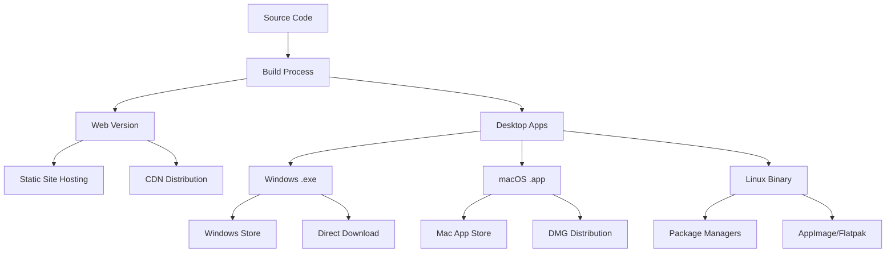

# 배포 가이드

VitePress Desktop 앱을 프로덕션 환경에 배포하는 방법을 설명합니다.

## 🚀 배포 전략 개요

### 이중 배포 아키텍처



## 📦 로컬 빌드

### 1. 전체 빌드 (권장)

```bash
# Makefile 사용 (권장)
make build-all

# 또는 npm 스크립트
npm run build:all

# 환경 변수와 함께
NODE_ENV=production make build-all
```

### 2. 플랫폼별 빌드

```bash
# 현재 OS용만 빌드
make build-desktop

# Windows 전용
make build-windows

# macOS 전용  
make build-mac

# Linux 전용
make build-linux
```

### 3. 빌드 결과 확인

```bash
# 빌드 결과물 구조
dist/
├── web/                    # 정적 웹 사이트
│   ├── index.html
│   ├── assets/
│   └── ...
└── desktop/               # 데스크톱 앱들
    ├── windows/
    │   └── vitepress-desktop.exe
    ├── darwin/
    │   └── vitepress-desktop.app/
    └── linux/
        └── vitepress-desktop

desktop/build/bin/         # Wails 빌드 결과
├── vitepress-desktop      # 현재 OS용
├── vitepress-desktop.exe  # Windows용
└── vitepress-desktop.app/ # macOS용
```

## 🌐 웹 사이트 배포

### 1. GitHub Pages

**자동 배포 설정:**

`.github/workflows/deploy-web.yml`:
```yaml
name: Deploy Web to GitHub Pages

on:
  push:
    branches: [ main ]
  workflow_dispatch:

permissions:
  contents: read
  pages: write
  id-token: write

jobs:
  deploy:
    environment:
      name: github-pages
      url: ${{ steps.deployment.outputs.page_url }}
    runs-on: ubuntu-latest
    
    steps:
    - name: Checkout
      uses: actions/checkout@v4
      
    - name: Setup Node.js
      uses: actions/setup-node@v4
      with:
        node-version: '20'
        cache: 'npm'
        
    - name: Install dependencies
      run: npm install
      
    - name: Build docs
      run: npm run docs:build
      
    - name: Setup Pages
      uses: actions/configure-pages@v4
      
    - name: Upload artifact
      uses: actions/upload-pages-artifact@v2
      with:
        path: 'docs/.vitepress/dist'
        
    - name: Deploy to GitHub Pages
      id: deployment
      uses: actions/deploy-pages@v3
```

**수동 배포:**
```bash
# 문서 빌드
npm run docs:build

# 빌드 결과를 gh-pages 브랜치에 배포
npx gh-pages -d docs/.vitepress/dist
```

### 2. Vercel 배포

**프로젝트 설정:**
```json
{
  "buildCommand": "npm run docs:build",
  "outputDirectory": "docs/.vitepress/dist",
  "installCommand": "npm install"
}
```

**vercel.json 설정:**
```json
{
  "build": {
    "env": {
      "NODE_ENV": "production"
    }
  },
  "rewrites": [
    {
      "source": "/(.*)",
      "destination": "/index.html"
    }
  ]
}
```

### 3. Netlify 배포

**netlify.toml 설정:**
```toml
[build]
  publish = "docs/.vitepress/dist"
  command = "npm run docs:build"

[[redirects]]
  from = "/*"
  to = "/index.html"
  status = 200

[build.environment]
  NODE_ENV = "production"
```

## 🖥️ 데스크톱 앱 배포

### 1. GitHub Releases 자동 배포

`.github/workflows/release.yml`:
```yaml
name: Build and Release Desktop Apps

on:
  push:
    tags:
      - 'v*'

jobs:
  build-and-release:
    strategy:
      matrix:
        include:
          - os: windows-latest
            platform: windows/amd64
            ext: .exe
          - os: macos-latest
            platform: darwin/universal
            ext: .app
          - os: ubuntu-latest
            platform: linux/amd64
            ext: ""

    runs-on: ${{ matrix.os }}

    steps:
    - name: Checkout code
      uses: actions/checkout@v4

    - name: Setup Node.js
      uses: actions/setup-node@v4
      with:
        node-version: '20'
        cache: 'npm'

    - name: Setup Go
      uses: actions/setup-go@v4
      with:
        go-version: '1.21'

    - name: Install Wails
      run: go install github.com/wailsapp/wails/v2/cmd/wails@latest

    - name: Install dependencies
      run: npm install

    - name: Build docs
      run: npm run docs:build

    - name: Build desktop app
      run: |
        cd desktop
        wails build -platform ${{ matrix.platform }} -ldflags "-s -w"

    - name: Prepare release assets
      run: |
        mkdir -p release
        if [ "${{ matrix.os }}" = "windows-latest" ]; then
          cp desktop/build/bin/*${{ matrix.ext }} release/
        elif [ "${{ matrix.os }}" = "macos-latest" ]; then
          cd desktop/build/bin
          zip -r ../../../release/vitepress-desktop-macos.zip *.app
        else
          cp desktop/build/bin/* release/vitepress-desktop-linux
        fi

    - name: Upload Release Assets
      uses: softprops/action-gh-release@v1
      if: startsWith(github.ref, 'refs/tags/')
      with:
        files: release/*
      env:
        GITHUB_TOKEN: ${{ secrets.GITHUB_TOKEN }}
```

### 2. 수동 릴리즈 과정

#### 버전 태그 생성

```bash
# 새 버전 태그 생성
git tag -a v1.0.0 -m "Release version 1.0.0"
git push origin v1.0.0

# 또는 GitHub CLI 사용
gh release create v1.0.0 --title "v1.0.0" --notes "Release notes here"
```

#### 플랫폼별 빌드 및 업로드

```bash
# 모든 플랫폼 빌드
make build-all

# 릴리즈 파일 압축
cd dist/desktop
zip -r ../../vitepress-desktop-windows.zip windows/
zip -r ../../vitepress-desktop-macos.zip darwin/
tar -czf ../../vitepress-desktop-linux.tar.gz linux/

# GitHub Release에 업로드
gh release upload v1.0.0 *.zip *.tar.gz
```

## 📱 앱 스토어 배포

### 1. Windows (Microsoft Store)

**준비 사항:**
- Microsoft Store 개발자 계정
- 앱 인증서 서명
- MSIX 패키지 생성

**MSIX 패키징:**
```bash
# Wails로 MSIX 패키지 생성
cd desktop
wails build -platform windows/amd64 -webview2 embed -upx -s

# 또는 수동으로 MSIX 생성
makeappx pack /d build/bin /p vitepress-desktop.msix
```

### 2. macOS (Mac App Store)

**코드 서명:**
```bash
# 개발자 인증서로 서명
codesign --deep --force --verify --verbose --sign "Developer ID Application: Your Name" vitepress-desktop.app

# 공증 (notarization)
xcrun notarytool submit vitepress-desktop.app.zip --keychain-profile "notarytool-password" --wait

# staple
xcrun stapler staple vitepress-desktop.app
```

**DMG 생성:**
```bash
# create-dmg 도구 사용
create-dmg \
  --volname "VitePress Desktop" \
  --window-pos 200 120 \
  --window-size 600 300 \
  --icon-size 100 \
  --icon "vitepress-desktop.app" 175 120 \
  --hide-extension "vitepress-desktop.app" \
  --app-drop-link 425 120 \
  "vitepress-desktop.dmg" \
  "build/bin/"
```

### 3. Linux (패키지 매니저)

#### AppImage 생성

```bash
# appimagetool 사용
wget https://github.com/AppImage/AppImageKit/releases/download/continuous/appimagetool-x86_64.AppImage
chmod +x appimagetool-x86_64.AppImage

# AppImage 구조 생성
mkdir -p VitePress-Desktop.AppDir/usr/bin
cp desktop/build/bin/vitepress-desktop VitePress-Desktop.AppDir/usr/bin/
cp desktop/build/appicon.png VitePress-Desktop.AppDir/vitepress-desktop.png

# desktop 파일 생성
cat > VitePress-Desktop.AppDir/vitepress-desktop.desktop << EOF
[Desktop Entry]
Name=VitePress Desktop
Exec=vitepress-desktop
Icon=vitepress-desktop
Type=Application
Categories=Development;Documentation;
EOF

# AppImage 빌드
./appimagetool-x86_64.AppImage VitePress-Desktop.AppDir
```

#### Flatpak 패키징

`com.example.VitepressDesktop.yaml`:
```yaml
app-id: com.example.VitepressDesktop
runtime: org.freedesktop.Platform
runtime-version: '22.08'
sdk: org.freedesktop.Sdk
command: vitepress-desktop

finish-args:
  - --share=ipc
  - --socket=x11
  - --device=dri

modules:
  - name: vitepress-desktop
    buildsystem: simple
    build-commands:
      - install -D vitepress-desktop /app/bin/vitepress-desktop
      - install -D vitepress-desktop.desktop /app/share/applications/com.example.VitepressDesktop.desktop
      - install -D appicon.png /app/share/icons/hicolor/512x512/apps/com.example.VitepressDesktop.png
    sources:
      - type: file
        path: desktop/build/bin/vitepress-desktop
      - type: file
        path: vitepress-desktop.desktop
      - type: file
        path: desktop/build/appicon.png
```

## 🔄 자동 업데이트 시스템

### 1. 업데이트 서버 설정

**업데이트 체크 API:**
```go
// desktop/updater.go
package main

import (
    "encoding/json"
    "fmt"
    "net/http"
    "context"
)

type UpdateInfo struct {
    Version     string `json:"version"`
    DownloadURL string `json:"download_url"`
    ReleaseNotes string `json:"release_notes"`
    Mandatory   bool   `json:"mandatory"`
}

func (a *App) CheckForUpdates(ctx context.Context) (*UpdateInfo, error) {
    resp, err := http.Get("https://api.example.com/vitepress-desktop/latest")
    if err != nil {
        return nil, err
    }
    defer resp.Body.Close()

    var updateInfo UpdateInfo
    if err := json.NewDecoder(resp.Body).Decode(&updateInfo); err != nil {
        return nil, err
    }

    return &updateInfo, nil
}
```

**업데이트 API 응답:**
```json
{
  "version": "1.1.0",
  "download_url": "https://github.com/user/repo/releases/download/v1.1.0/vitepress-desktop.exe",
  "release_notes": "Bug fixes and performance improvements",
  "mandatory": false
}
```

### 2. 클라이언트 업데이트 로직

**프론트엔드 업데이트 체크:**
```javascript
// 업데이트 체크
async function checkForUpdates() {
  try {
    const updateInfo = await window.go.main.App.CheckForUpdates();
    
    if (updateInfo && updateInfo.version !== currentVersion) {
      showUpdateNotification(updateInfo);
    }
  } catch (error) {
    console.error('Update check failed:', error);
  }
}

// 업데이트 알림 표시
function showUpdateNotification(updateInfo) {
  const notification = {
    title: 'Update Available',
    message: `Version ${updateInfo.version} is available`,
    buttons: ['Update Now', 'Later'],
    callback: (buttonIndex) => {
      if (buttonIndex === 0) {
        downloadUpdate(updateInfo.download_url);
      }
    }
  };
  
  showNotification(notification);
}
```

## 📊 배포 후 모니터링

### 1. 사용량 추적

**Google Analytics 설정:**
```html
<!-- docs/.vitepress/theme/Layout.vue -->
<script>
export default {
  mounted() {
    if (typeof gtag !== 'undefined') {
      gtag('config', 'GA_MEASUREMENT_ID', {
        page_title: document.title,
        page_location: window.location.href
      });
    }
  }
}
</script>
```

### 2. 오류 추적

**Sentry 통합:**
```javascript
// 프론트엔드
import * as Sentry from '@sentry/browser';

Sentry.init({
  dsn: 'YOUR_SENTRY_DSN',
  environment: 'production'
});

// 전역 오류 처리
window.addEventListener('error', (event) => {
  Sentry.captureException(event.error);
});
```

**Go 백엔드 오류 추적:**
```go
// desktop/error_tracking.go
package main

import (
    "github.com/getsentry/sentry-go"
    "log"
)

func initErrorTracking() {
    err := sentry.Init(sentry.ClientOptions{
        Dsn: "YOUR_SENTRY_DSN",
        Environment: "production",
    })
    if err != nil {
        log.Printf("Sentry initialization failed: %v", err)
    }
}

func (a *App) reportError(err error) {
    sentry.CaptureException(err)
}
```

## 🔒 보안 고려사항

### 1. 코드 서명

**Windows:**
```bash
# 인증서로 EXE 파일 서명
signtool sign /f certificate.pfx /p password /t http://timestamp.digicert.com vitepress-desktop.exe
```

**macOS:**
```bash
# 코드 서명
codesign --force --options runtime --sign "Developer ID Application" vitepress-desktop.app
```

### 2. 보안 업데이트

- 정기적인 의존성 업데이트
- 보안 취약점 스캔
- 안전한 업데이트 채널 구축

## 📈 성능 최적화

### 1. 빌드 최적화

```bash
# 프로덕션 빌드 최적화
NODE_ENV=production npm run build:all

# Go 바이너리 크기 최적화
cd desktop
wails build -ldflags "-s -w" -upx
```

### 2. 자산 최적화

- 이미지 압축 (WebP, AVIF)
- CSS/JS 미니파이
- 트리 쉐이킹
- 코드 분할

## ✅ 배포 체크리스트

### 릴리즈 전 점검

- [ ] 모든 테스트 통과
- [ ] 문서 업데이트
- [ ] 버전 번호 업데이트
- [ ] 체인지로그 작성
- [ ] 보안 검토 완료

### 빌드 점검

- [ ] 모든 플랫폼 빌드 성공
- [ ] 실행 파일 테스트 완료
- [ ] 파일 크기 확인
- [ ] 의존성 번들링 확인

### 배포 후 점검

- [ ] 웹사이트 정상 동작
- [ ] 다운로드 링크 확인
- [ ] 자동 업데이트 테스트
- [ ] 모니터링 대시보드 확인

---

배포에 문제가 있나요? [트러블슈팅 가이드](./troubleshooting.md)를 확인하거나 [GitHub Issues](https://github.com/yourusername/vitepress-desktop/issues)에 문의하세요! 🚑