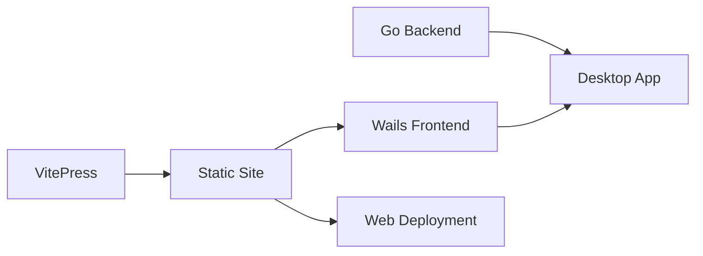

# VitePress Desktop

VitePress와 Wails를 결합하여 문서를 데스크톱 애플리케이션으로 배포하는 오픈소스 프로젝트

## 🚀 프로젝트 소개

VitePress Desktop은 VitePress로 작성한 문서를 크로스 플랫폼 데스크톱 애플리케이션으로 변환할 수 있게 해주는 프로젝트입니다. 웹 기반 문서와 네이티브 데스크톱 앱을 동시에 제공하고자 하는 프로젝트에 적합합니다.

### 주요 특징

- **📚 듀얼 플랫폼 지원**: 하나의 코드베이스로 웹과 데스크톱 앱 동시 배포
- **⚡ 빠른 성능**: VitePress의 빠른 빌드 속도와 Wails의 경량 런타임
- **🎨 완전한 커스터마이징**: Vue 3 기반으로 자유로운 UI/UX 구현
- **🌍 크로스 플랫폼**: Windows, macOS, Linux 모두 지원
- **📦 작은 번들 크기**: Go 바이너리로 컴파일되어 작고 빠른 실행 파일

## 🎯 이런 분들에게 추천합니다

- **오픈소스 프로젝트 메인테이너**: 프로젝트 문서를 다양한 형태로 배포하고 싶은 분
- **기술 문서 작성자**: 온라인/오프라인 환경 모두에서 접근 가능한 문서가 필요한 분
- **교육 콘텐츠 제작자**: 인터넷 연결 없이도 사용 가능한 교육 자료를 만들고 싶은 분
- **기업 내부 문서 관리자**: 보안상 격리된 환경에서 문서를 배포해야 하는 분

## 💡 사용 사례

### 1. 오픈소스 프로젝트 문서
- 프로젝트 웹사이트와 다운로드 가능한 문서 뷰어 동시 제공
- 오프라인 환경에서도 문서 참조 가능
- 버전별 문서를 독립 실행 파일로 배포

### 2. 기업 내부 문서
- 인트라넷 환경에서 독립 실행 가능한 문서 시스템
- 민감한 정보를 포함한 문서의 안전한 배포
- 네트워크 없는 환경에서도 접근 가능

### 3. 교육 자료
- 학생들에게 배포 가능한 독립 실행형 교재
- 인터랙티브한 학습 콘텐츠 제작
- 실습 환경이 통합된 문서

## 🛠 기술 스택

- **Frontend**: VitePress (Vue 3 + Vite)
- **Backend**: Go + Wails v2
- **Build Tools**: Node.js, Go compiler
- **Supported OS**: Windows, macOS, Linux

## 📋 기능

### 문서 기능
- ✅ Markdown 기반 문서 작성
- ✅ Vue 컴포넌트 임베딩
- ✅ Mermaid 다이어그램 지원
- ✅ 코드 하이라이팅
- ✅ 검색 기능
- ✅ 다크/라이트 테마
- ✅ 다국어 지원

### 데스크톱 앱 기능
- ✅ 네이티브 윈도우 컨트롤
- ✅ 시스템 트레이 지원 (선택)
- ✅ 자동 업데이트 (선택)
- ✅ 로컬 파일 시스템 접근 (선택)
- ✅ OS 네이티브 알림

## 🚦 시작하기

자세한 설치 및 사용 방법은 다음 문서를 참고하세요:

- [설치 가이드](./installation.md)
- [빠른 시작](./quick-start.md)
- [설정 가이드](./configuration.md)
- [배포 가이드](./deployment.md)

## 📊 프로젝트 비교

| 특징 | VitePress Desktop | Electron + Docs | Static Site Only |
|------|------------------|-----------------|------------------|
| 번들 크기 | ⭐⭐⭐⭐⭐ (~10MB) | ⭐⭐ (~100MB) | - |
| 시작 속도 | ⭐⭐⭐⭐⭐ | ⭐⭐⭐ | - |
| 메모리 사용 | ⭐⭐⭐⭐⭐ (~30MB) | ⭐⭐ (~200MB) | - |
| 오프라인 지원 | ✅ | ✅ | ❌ |
| 웹 배포 | ✅ | ❌ | ✅ |
| 네이티브 기능 | ✅ | ✅ | ❌ |
| 개발 복잡도 | ⭐⭐⭐ | ⭐⭐⭐⭐ | ⭐ |

## 🤝 기여하기

VitePress Desktop은 오픈소스 프로젝트입니다. 다음과 같은 방법으로 기여할 수 있습니다:

1. **버그 리포트**: 문제를 발견하면 GitHub Issues에 보고
2. **기능 제안**: 새로운 아이디어를 Issues에서 논의
3. **코드 기여**: Pull Request를 통한 직접 기여
4. **문서 개선**: 오타 수정, 번역, 예제 추가
5. **프로젝트 홍보**: 블로그 포스트, 소셜 미디어 공유

## 📜 라이선스

이 프로젝트는 MIT 라이선스 하에 배포됩니다. 자유롭게 사용, 수정, 배포할 수 있습니다.

## 🔗 관련 링크

- [GitHub Repository](https://github.com/yourusername/vitepress-desktop)
- [VitePress 공식 문서](https://vitepress.dev)
- [Wails 공식 문서](https://wails.io)
- [예제 프로젝트](./examples.md)

## 💬 커뮤니티

- [Discord 서버](#)
- [GitHub Discussions](#)
- [Stack Overflow Tag](#)

---

VitePress Desktop으로 문서를 더 널리, 더 쉽게 배포하세요! 🚀