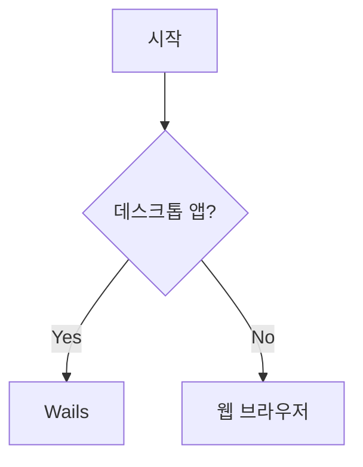

# 빠른 시작 가이드

5분 안에 첫 VitePress Desktop 앱을 만들어보세요!

## 🎯 목표

이 가이드를 통해 다음을 수행합니다:
- 간단한 문서 사이트 생성
- 데스크톱 앱으로 빌드
- 실행 파일 생성 및 테스트

## 📝 Step 1: 문서 작성

### VitePress 문서 생성

```bash
# 프로젝트 디렉토리 생성
mkdir my-docs-app
cd my-docs-app

# VitePress 초기화
npm init -y
npm install -D vitepress
```

### 기본 문서 구조

```bash
# 문서 디렉토리 생성
mkdir -p docs/.vitepress
mkdir -p docs/guide
```

### 홈페이지 생성

`docs/index.md`:
```markdown
---
layout: home

hero:
  name: My Documentation
  text: 데스크톱 앱으로 만나는 문서
  tagline: VitePress Desktop으로 제작
  actions:
    - theme: brand
      text: 시작하기
      link: /guide/getting-started
    - theme: alt
      text: GitHub에서 보기
      link: https://github.com

features:
  - title: 빠른 성능
    details: Go 기반 백엔드로 빠른 시작과 낮은 메모리 사용
  - title: 크로스 플랫폼
    details: Windows, macOS, Linux 모두 지원
  - title: 오프라인 지원
    details: 인터넷 연결 없이도 문서 열람 가능
---
```

### 첫 가이드 문서

`docs/guide/getting-started.md`:
```markdown
# 시작하기

환영합니다! 이것은 데스크톱 앱으로 실행되는 문서입니다.

## 기능

- ✨ 마크다운 문서
- 🎨 Vue 컴포넌트
- 🚀 빠른 로딩

## 예제 코드

\```javascript
function hello() {
  console.log('Hello, Desktop App!')
}
\```
```

## ⚙️ Step 2: VitePress 설정

### 설정 파일 생성

`docs/.vitepress/config.js`:
```javascript
export default {
  title: 'My Documentation',
  description: 'Desktop app documentation',
  
  themeConfig: {
    nav: [
      { text: '홈', link: '/' },
      { text: '가이드', link: '/guide/getting-started' }
    ],
    
    sidebar: [
      {
        text: '가이드',
        items: [
          { text: '시작하기', link: '/guide/getting-started' }
        ]
      }
    ],
    
    socialLinks: [
      { icon: 'github', link: 'https://github.com' }
    ]
  }
}
```

### package.json 스크립트 추가

```json
{
  "scripts": {
    "docs:dev": "vitepress dev docs",
    "docs:build": "vitepress build docs",
    "docs:preview": "vitepress preview docs"
  }
}
```

### 개발 서버 실행

```bash
# 개발 서버 시작
npm run docs:dev

# 브라우저에서 http://localhost:5173 열기
```

## 🖥️ Step 3: 데스크톱 앱 생성

### 현재 프로젝트의 데스크톱 앱 구조

```bash
# 데스크톱 앱 디렉토리는 이미 존재
desktop/
├── app.go         # 애플리케이션 로직
├── main.go        # 메인 엔트리
├── wails.json     # Wails 설정
├── go.mod         # Go 모듈 정의
└── frontend/      # 프론트엔드 파일

# Go 모듈 설치
cd desktop
go mod download
cd ..
```

### Wails 설정 수정

`desktop/wails.json`:
```json
{
  "$schema": "https://wails.io/schemas/config.v2.json",
  "name": "My Docs App",
  "outputfilename": "my-docs-app",
  "frontend:install": "",
  "frontend:build": "",
  "frontend:dev:watcher": "",
  "frontend:dev:serverUrl": "",
  "author": {
    "name": "Your Name",
    "email": "your@email.com"
  }
}
```

### 백엔드 설정

`desktop/app.go`:
```go
package main

import (
    "context"
    "embed"
)

//go:embed all:frontend/dist
var assets embed.FS

type App struct {
    ctx context.Context
}

func NewApp() *App {
    return &App{}
}

func (a *App) startup(ctx context.Context) {
    a.ctx = ctx
}

func (a *App) GetTitle() string {
    return "My Documentation"
}
```

## 🔨 Step 4: 빌드 스크립트

### 빌드 스크립트 생성

`scripts/build.js`:
```javascript
import { execSync } from 'child_process';
import { copyFileSync, mkdirSync, cpSync } from 'fs';
import { join } from 'path';

console.log('🔨 Building VitePress...');
execSync('npm run docs:build', { stdio: 'inherit' });

console.log('📁 Copying to desktop frontend...');
const source = 'docs/.vitepress/dist';
const target = 'desktop/frontend/dist';

mkdirSync(target, { recursive: true });
cpSync(source, target, { recursive: true });

console.log('🚀 Building desktop app...');
process.chdir('desktop');
execSync('wails build', { stdio: 'inherit' });
process.chdir('..');

console.log('✅ Build complete!');
```

### package.json 업데이트

```json
{
  "type": "module",
  "scripts": {
    "docs:dev": "vitepress dev docs",
    "docs:build": "vitepress build docs",
    "docs:preview": "vitepress preview docs",
    "build": "node scripts/build.js",
    "dev:desktop": "cd desktop && wails dev"
  }
}
```

## 🚀 Step 5: 빌드 및 실행

### 전체 빌드

```bash
# 문서와 데스크톱 앱 빌드
npm run build
```

### 빌드 결과물

```
desktop/build/bin/
├── my-docs-app        # Linux/macOS 실행 파일
└── my-docs-app.exe    # Windows 실행 파일
```

### 앱 실행

::: code-group

```bash [Windows]
# Windows
desktop\build\bin\my-docs-app.exe
```

```bash [macOS]
# macOS
open desktop/build/bin/my-docs-app.app

# 또는 직접 실행
./desktop/build/bin/my-docs-app
```

```bash [Linux]
# Linux
./desktop/build/bin/my-docs-app
```

:::

## 🎨 Step 6: 커스터마이징

### 아이콘 설정

1. `desktop/build/appicon.png` 파일 교체 (1024x1024 권장)
2. 다시 빌드: `npm run build`

### 창 크기 설정

`desktop/main.go`:
```go
func main() {
    app := NewApp()

    err := wails.Run(&options.App{
        Title:  "My Documentation",
        Width:  1200,
        Height: 800,
        MinWidth: 800,
        MinHeight: 600,
        AssetServer: &assetserver.Options{
            Assets: assets,
        },
        OnStartup: app.startup,
        Bind: []interface{}{
            app,
        },
    })

    if err != nil {
        println("Error:", err.Error())
    }
}
```

### 메뉴 추가

`desktop/menu.go`:
```go
func AppMenu() *menu.Menu {
    appMenu := menu.NewMenu()
    
    fileMenu := appMenu.AddSubmenu("File")
    fileMenu.AddText("New Window", keys.CmdOrCtrl("n"), func(_ *menu.CallbackData) {
        // 새 창 열기
    })
    fileMenu.AddSeparator()
    fileMenu.AddText("Quit", keys.CmdOrCtrl("q"), func(_ *menu.CallbackData) {
        runtime.Quit()
    })
    
    return appMenu
}
```

## ✨ 고급 기능

### Vue 컴포넌트 추가

`docs/.vitepress/components/Counter.vue`:
```vue
<template>
  <button @click="count++">
    Count: {{ count }}
  </button>
</template>

<script setup>
import { ref } from 'vue'
const count = ref(0)
</script>

<style scoped>
button {
  padding: 10px 20px;
  background: var(--vp-c-brand);
  color: white;
  border: none;
  border-radius: 4px;
  cursor: pointer;
}
</style>
```

문서에서 사용:
```markdown
# 컴포넌트 예제

<script setup>
import Counter from '.vitepress/components/Counter.vue'
</script>

<Counter />
```

### Mermaid 다이어그램

설치:
```bash
npm install -D vitepress-plugin-mermaid mermaid
```

설정:
```javascript
// .vitepress/config.js
import { withMermaid } from 'vitepress-plugin-mermaid'

export default withMermaid({
  // ... 기존 설정
  mermaid: {
    theme: 'dark'
  }
})
```

사용:
````markdown

````

## 📦 배포

### GitHub Releases

1. GitHub Actions 워크플로우 생성
2. 자동 빌드 및 릴리즈
3. 사용자가 다운로드

### 자동 업데이트

Wails는 자동 업데이트 기능을 지원합니다:
- GitHub Releases 연동
- 백그라운드 다운로드
- 자동 설치

## 🎉 완성!

축하합니다! 첫 VitePress Desktop 앱을 만들었습니다.

### 다음 단계

- [프로젝트 구조](./structure.md) - 구조 이해하기
- [설정 가이드](./configuration.md) - 상세 설정
- [배포 가이드](./deployment.md) - 프로덕션 배포

### 체크리스트

- ✅ VitePress 문서 생성
- ✅ 데스크톱 앱 초기화
- ✅ 빌드 스크립트 작성
- ✅ 실행 파일 생성
- ✅ 커스터마이징 적용

## 💡 팁

1. **개발 모드**: `npm run dev:desktop`으로 핫 리로드 개발
2. **디버깅**: Wails는 개발자 도구 내장 (F12)
3. **성능**: 프로덕션 빌드는 `-ldflags "-s -w"` 플래그로 최적화

---

문제가 있나요? [트러블슈팅 가이드](./troubleshooting.md)를 확인하세요! 🔧